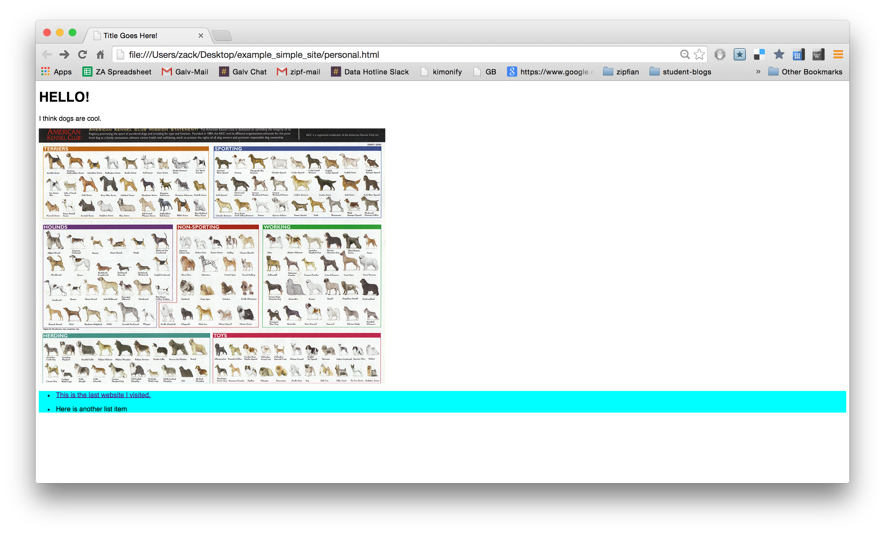

# Web Awareness
In this chapter, we will be reviewing basic HTML and CSS structure.  
Your assignment is to build a basic bio page in HTML and CSS.  The main objective is to understand the fundamental structure of HTML tag elements (such as `<head>` or `
` ).

## Why do we need to know HTML?
The first reason we as data scientists need to learn HTML and CSS is to present and share our ideas.  What good is the best model if nobody knows about it?  
The second reason to learn HTML for data science is to better understand how to scrape data from the web.  One of the main ways we scrape and extract data is through html tag referencing.

## Instructions
Your task is to create a super simple bio webpage in HTML, styled with CSS.  Fill out the `personal.html` and the `personal.css` files provided in the code folder with your own code.  Your web page should include the following:
*  Your name at the top of the page as an `<h1>` heading.
http://www.w3schools.com/html/default.asp
*  An image of yourself (or your hero) that floats on the left.
http://www.w3schools.com/html/html_images.asp
*  Two paragraphs about yourself.
http://www.w3schools.com/tags/tag_p.asp
*  Two highlighted words using the `` tag.
http://www.w3schools.com/tags/tag_span.asp
*  An unordered HTML list, with links to three pages that you like.  http://www.w3schools.com/tags/tag_ul.asp
*  An external CSS style sheet
http://www.w3schools.com/css/css_howto.asp

Your site should look something like this.  

The HTML and CSS should look something like this.

 
#Resources
The number one resource for anything web is http://www.w3schools.com
I dont know any web developers that don't use this site.  You can easily complete this assignment with just this resource.  
